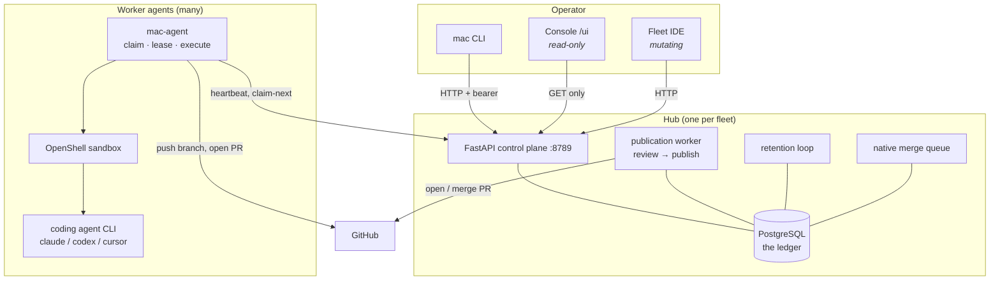
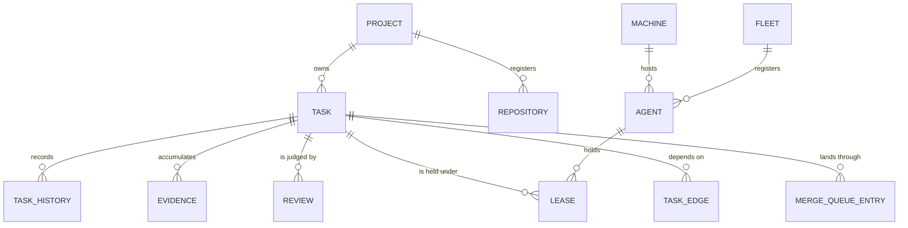
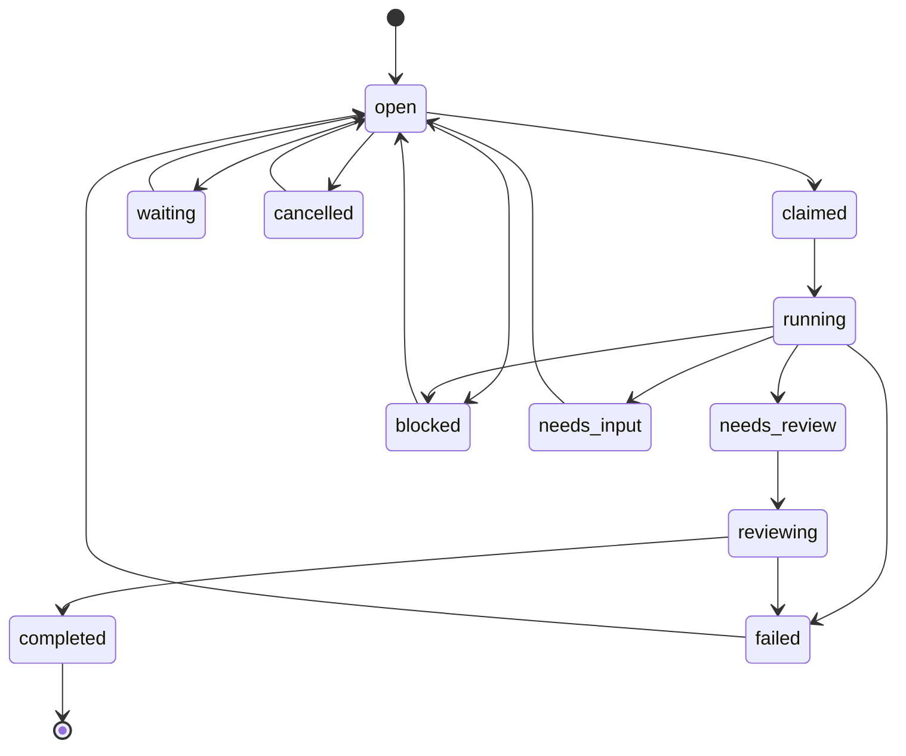
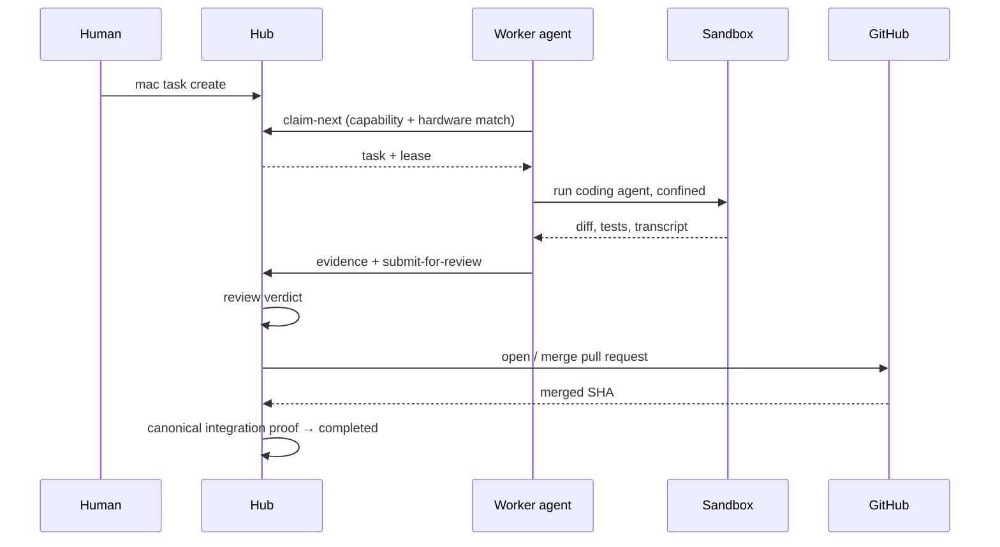
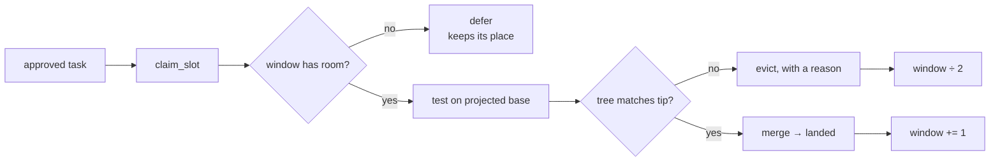

# System Architecture

This page is generated from reading the code, not from memory. Every state,
transition and object named here is checked against `src/mac/models.py`,
`src/mac/data/postgres/schema.sql` and the live route table. Where a capability
is partial or unwired, it says so.

## The shape of the system

mac is a hub-and-spoke control plane. One **hub** owns the durable state and
serves an HTTP API; **worker agents** on other machines claim work from it and
execute that work inside a sandbox. Nothing else is authoritative — an agent's
local disk is scratch, and the ledger is the truth.

The hub never executes task work. It stores, schedules, reviews and publishes.
Workers never own state: they lease it.

## First-class objects

Three objects are first-class at the CLI (`mac <object> <verb>`), and the rest
of the model hangs off them. This is `FIRST_CLASS` in `src/mac/cli_surface.py`,
not a taxonomy invented for this page:

| object | one line | where it lives |
|---|---|---|
| **project** | a unit of work ownership: repositories, policy, dispatch state | `projects`, `project_repositories` |
| **task** | one unit of work: the thing agents claim, run, and publish | `tasks`, `task_history`, `task_edges` |
| **agent** | a worker that claims and executes tasks on a machine | `agents`, `machines`, `leases` |

Everything else is administered under `mac admin ...` — fleets, secrets,
runtimes, AgentBus, observability, memory, reviews, publications.

## Actors

An **actor** is anything that can change the ledger. Naming them matters
because authority differs:

- **Human operator** — full authority through the CLI or the Fleet IDE. Some
  routes (`/agentbus/human-directive`) *refuse* agent tokens entirely, so
  operator speech is distinguishable from agent speech by construction.
- **Hub** — schedules dispatch, runs the review sweep, publishes, prunes. It
  observes runaway conditions but, today, cannot act on them (see
  [Advanced Concepts](03-advanced.md#what-the-hub-cannot-do-yet)).
- **Worker agent** (`mac-agent`) — registers, heartbeats, claims one task at a
  time under a lease, executes it, submits evidence.
- **Coding agent** — the CLI (Claude Code, Codex, Cursor) the worker spawns
  *inside* a sandbox to do the actual work. It is not a mac principal; the
  worker is.
- **Reviewer** — an agent or the default review workflow, producing a verdict
  that gates publication.

## The life of a task

The state machine is enforced by the control plane. These are the real edges
from `TASK_TRANSITIONS` in `src/mac/models.py`:

Two properties surprise people, and both are deliberate:

- **`completed` is the only truly terminal state.** `failed` and `cancelled`
  both allow `-> open`, because a task that died is often a task to retry.
- **You cannot jump to `completed`.** It is reachable only from `reviewing`,
  and only with durable canonical integration proof — a merged commit on the
  canonical branch. `mac task force-complete` exists as audited break-glass and
  still refuses without that proof.

## How work actually flows

The lease is the concurrency primitive: one live lease per task, renewed by
heartbeat, reclaimed on expiry. A worker that dies mid-task loses its lease and
the task returns to the pool rather than being stranded.

## Publication and the merge queue

GitHub merge queues are an **organization-only** feature, so a personal
repository gets no forge-side serialization. mac provides its own
(`src/mac/native_merge_queue.py`): an ordered queue per
`(repository, canonical branch)` with an AIMD speculation window.

The safety property is structural rather than bookkeeping: each entry records
the *tree* it was tested against, and the land gate refuses unless the
canonical tip's tree is byte-identical. Trees rather than SHAs is what survives
a squash merge.

## Sandboxing

Task execution is confined by OpenShell, and the gate fails closed: if no
verified sandbox is available, the task fails rather than running unconfined.
Running unsandboxed requires explicit break-glass.

## AgentBus

A fleet-wide message bus. Workers **emit** typed events from their own git and
task paths — `git.pushed`, `git.branch_created`, `task.claimed`,
`task.released`, `capacity.saturated` — and the hub relays them. The hub emits
the terminal ones itself, from the merge path: `git.merged` (with the
`tree_sha` the change landed as, which survives the squash the commit sha does
not) and `git.canonical_advanced`.

Workers **consume** it too. Before claiming a task a worker acts on
`sandbox.policy_changed`; before starting one it reads the recent relevant
traffic and attaches it to the task the coding agent receives, so the agent
starts knowing whether its work already landed and whether the trunk moved
under it. What is still missing is documented in
[Advanced Concepts](03-advanced.md#agentbus-consumption-is-partial).

## Where to go next

- [Getting Started](02-getting-started.md) — stand up a fleet and run a task
- [Advanced Concepts](03-advanced.md) — leases, evidence, review, publication,
  and the known gaps
- [The UI](04-ui.md) — the console and the Fleet IDE
- [Developer Guide](05-developer-guide.md) — how to hack on mac
- [Contributing](https://github.com/jordanhubbard/mac/blob/main/CONTRIBUTING.md) — filing issues and well-tested PRs
