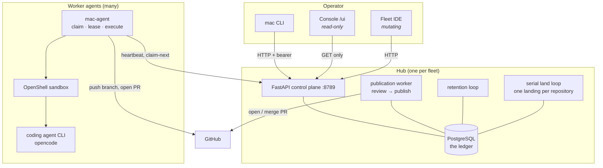
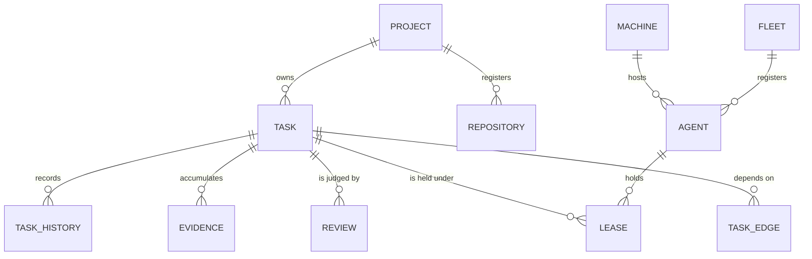
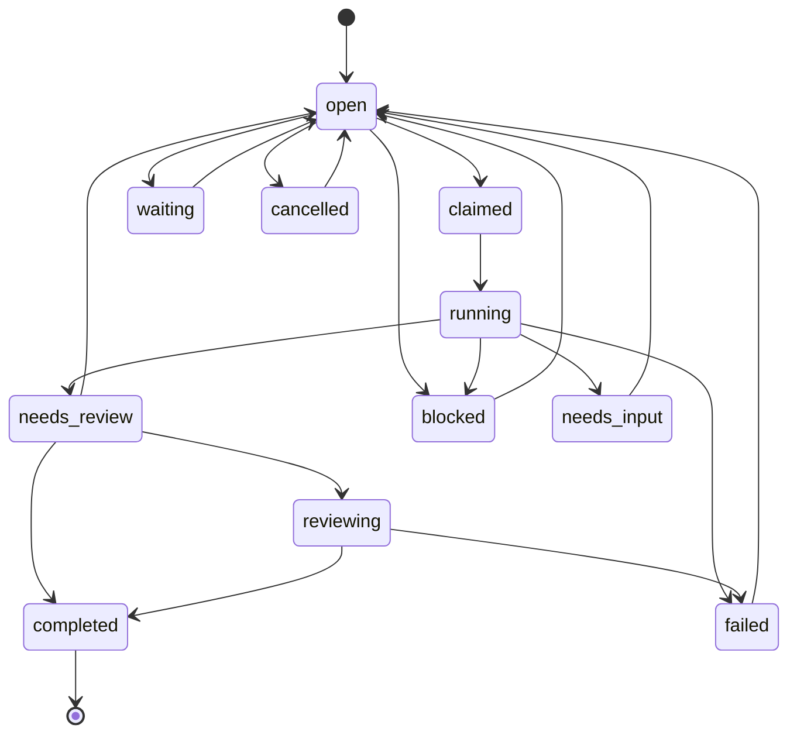
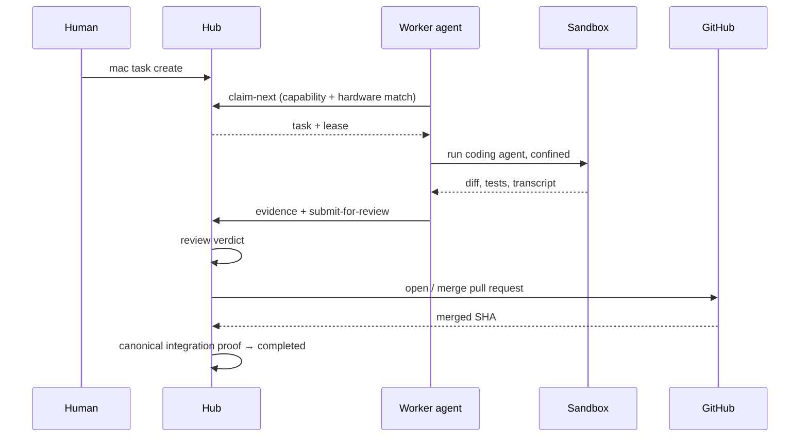
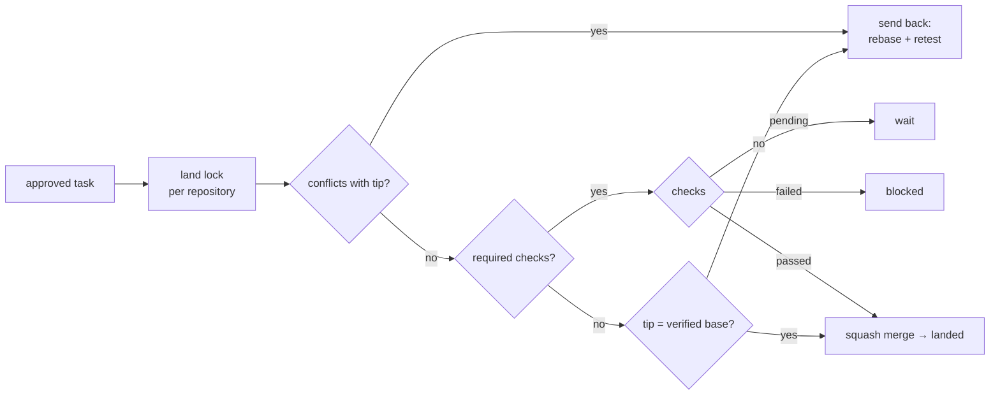

# System Architecture

This page is generated from reading the code, not from memory. Every state,
transition and object named here is checked against `src/mac/models.py`,
`src/mac/data/postgres/schema.sql` and the live route table. Where a capability
is partial or unwired, it says so.

## The shape of the system

mac is a hub-and-spoke control plane. One **hub** owns the durable state and
serves an HTTP API; **worker agents** on other machines claim work from it and
execute that work inside a sandbox. Nothing else is authoritative — an agent's
local disk is scratch, and the ledger is the truth.

```mermaid
graph TB
    subgraph Operator
        CLI["mac CLI"]
        UI["Console /ui<br/><i>read-only</i>"]
        IDE["Fleet IDE<br/><i>mutating</i>"]
    end

    subgraph Hub["Hub (one per fleet)"]
        API["FastAPI control plane :8789"]
        DB[("PostgreSQL<br/>the ledger")]
        SWEEP["publication worker<br/>review → publish"]
        RET["retention loop"]
        LAND["serial land loop<br/>one landing per repository"]
    end

    subgraph Workers["Worker agents (many)"]
        W1["mac-agent<br/>claim · lease · execute"]
        SB["OpenShell sandbox"]
        CA["coding agent CLI<br/>opencode"]
    end

    FORGE["GitHub"]

    CLI -->|HTTP + bearer| API
    UI -->|GET only| API
    IDE -->|HTTP| API
    API --- DB
    SWEEP --- DB
    RET --- DB
    LAND --- DB
    W1 -->|heartbeat, claim-next| API
    W1 --> SB --> CA
    SWEEP -->|open / merge PR| FORGE
    W1 -->|push branch, open PR| FORGE
```

The hub never executes task work. It stores, schedules, reviews and publishes.
Workers never own state: they lease it.

## First-class objects

Three objects are first-class at the CLI (`mac <object> <verb>`), and the rest
of the model hangs off them. This is `FIRST_CLASS` in `src/mac/cli_surface.py`,
not a taxonomy invented for this page:

| object | one line | where it lives |
|---|---|---|
| **project** | a unit of work ownership: repositories, policy, dispatch state | `projects`, `project_repositories` |
| **task** | one unit of work: the thing agents claim, run, and publish | `tasks`, `task_history`, `task_edges` |
| **agent** | a worker that claims and executes tasks on a machine | `agents`, `machines`, `leases` |

Everything else is administered under `mac admin ...` — fleets, secrets,
runtimes, AgentBus, observability, memory, reviews, publications.

```mermaid
erDiagram
    PROJECT ||--o{ TASK : owns
    PROJECT ||--o{ REPOSITORY : registers
    TASK ||--o{ TASK_HISTORY : records
    TASK ||--o{ EVIDENCE : accumulates
    TASK ||--o{ REVIEW : "is judged by"
    TASK ||--o{ LEASE : "is held under"
    TASK ||--o{ TASK_EDGE : "depends on"
    MACHINE ||--o{ AGENT : hosts
    AGENT ||--o{ LEASE : holds
    FLEET ||--o{ AGENT : registers
```

## Actors

An **actor** is anything that can change the ledger. Naming them matters
because authority differs:

- **Human operator** — full authority through the CLI or the Fleet IDE. Some
  routes (`/agentbus/human-directive`) *refuse* agent tokens entirely, so
  operator speech is distinguishable from agent speech by construction.
- **Hub** — schedules dispatch, runs the review sweep, publishes, prunes. It
  performs recovery within its authenticated task and lease authority; the
  [recovery and delivery limits](03-advanced.md#recovery-and-delivery-limits)
  describe what remains outside that control.
- **Worker agent** (`mac-agent`) — registers, heartbeats, claims one task at a
  time under a lease, executes it, submits evidence.
- **Coding agent** — opencode, the one CLI the worker spawns *inside* a
  sandbox to do the actual work. It takes its model from the hub router with a
  per-task inference token. It is not a mac principal; the worker is.
- **Reviewer** — an agent or the default review workflow, producing a verdict
  that gates publication.

## The life of a task

The state machine is enforced by the control plane. These are the real edges
from `TASK_TRANSITIONS` in `src/mac/models.py`:

```mermaid
stateDiagram-v2
    [*] --> open
    open --> claimed
    claimed --> running
    running --> needs_review
    needs_review --> completed
    needs_review --> open
    needs_review --> reviewing
    reviewing --> completed

    open --> waiting
    open --> blocked
    running --> blocked
    running --> needs_input
    needs_input --> open
    blocked --> open
    waiting --> open

    running --> failed
    reviewing --> failed
    failed --> open
    open --> cancelled
    cancelled --> open

    completed --> [*]
```

Two properties surprise people, and both are deliberate:

- **`completed` is the only truly terminal state.** `failed` and `cancelled`
  both allow `-> open`, because a task that died is often a task to retry.
- **You cannot jump to `completed`.** It is reachable only from review
  (`needs_review`, or `reviewing`), only with an approved review, and only with
  durable canonical integration proof — a merged commit on the canonical
  branch. `mac task force-complete` exists as audited break-glass and still
  refuses without that proof.

The default workflow never enters `reviewing`: the hub-reviewer approves from
the worker's verified evidence and the land loop publishes straight from
`needs_review` (a rejection or a rebase send-back reopens the task). Only a
human-requested review (`POST /tasks/{id}/reviews`) moves a task to
`reviewing`; older rows in that state still complete through the land loop.

## How work actually flows

```mermaid
sequenceDiagram
    participant H as Human
    participant Hub
    participant W as Worker agent
    participant S as Sandbox
    participant G as GitHub

    H->>Hub: mac task create
    W->>Hub: claim-next (capability + hardware match)
    Hub-->>W: task + lease
    W->>S: run coding agent, confined
    S-->>W: diff, tests, transcript
    W->>Hub: evidence + submit-for-review
    Hub->>Hub: review verdict
    Hub->>G: open / merge pull request
    G-->>Hub: merged SHA
    Hub->>Hub: canonical integration proof → completed
```

The lease is the concurrency primitive: one live lease per task, renewed by
heartbeat, reclaimed on expiry. A worker that dies mid-task loses its lease and
the task returns to the pool rather than being stranded.

## Publication: the serial land loop

Approved work lands one change at a time per `(repository, canonical branch)`,
under a PostgreSQL advisory lock. One test gate decides each landing: the
repository's required status checks where it has them, otherwise the worker's
own verifier run. The hub runs no tests itself.

Without required checks, the worker's result covers the landed tree only while
the canonical tip is still the base it verified. A moved tip, or a conflict
with it, sends the same task back to its worker to rebase and retest, at most
twice before the task blocks.

```mermaid
graph LR
    A["approved task"] --> L["land lock<br/>per repository"]
    L --> C{"conflicts with tip?"}
    C -->|yes| R["send back:<br/>rebase + retest"]
    C -->|no| K{"required checks?"}
    K -->|yes| P{"checks"}
    P -->|pending| W["wait"]
    P -->|failed| B["blocked"]
    P -->|passed| M["squash merge → landed"]
    K -->|no| T{"tip = verified base?"}
    T -->|no| R
    T -->|yes| M
```

## Sandboxing

Task execution is confined by OpenShell, and the gate fails closed: if no
verified sandbox is available, the task fails rather than running unconfined.
Running unsandboxed requires explicit break-glass.

## AgentBus

A fleet-wide message bus. Workers **emit** typed events from their own git and
task paths — `git.pushed`, `git.branch_created`, `task.claimed`,
`task.released`, `capacity.saturated` — and the hub relays them. The hub emits
the terminal ones itself, from the merge path: `git.merged` (with the
`tree_sha` the change landed as, which survives the squash the commit sha does
not) and `git.canonical_advanced`.

Workers **consume** it too. Before claiming a task a worker acts on
`sandbox.policy_changed`; before starting one it reads the recent relevant
traffic and attaches it to the task the coding agent receives, so the agent
starts knowing whether its work already landed and whether the trunk moved
under it. What is still missing is documented in
[recovery and delivery limits](03-advanced.md#recovery-and-delivery-limits).

## Where to go next

- [Getting Started](02-getting-started.md) — stand up a fleet and run a task
- [Advanced Concepts](03-advanced.md) — leases, evidence, review, publication,
  and the known gaps
- [The UI](04-ui.md) — the console and the Fleet IDE
- [Developer Guide](05-developer-guide.md) — how to hack on mac
- [Contributing](https://github.com/jordanhubbard/mac/blob/main/CONTRIBUTING.md) — filing issues and well-tested PRs
