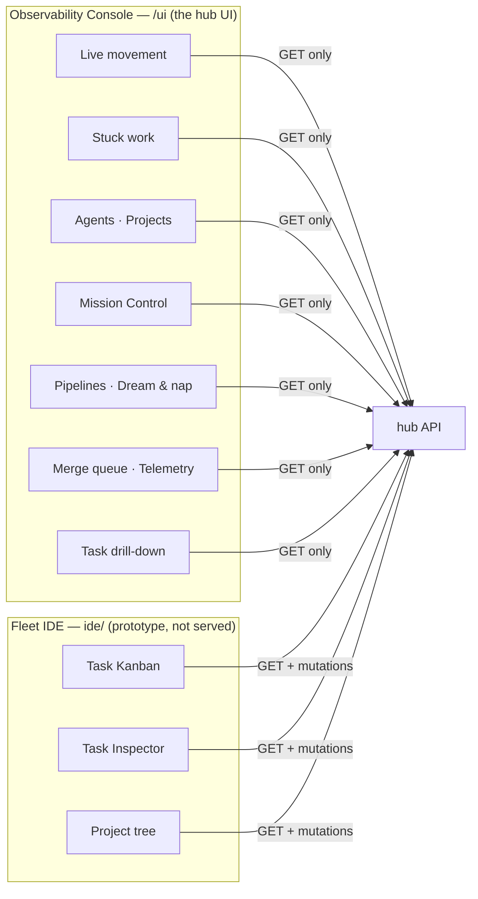

# The UI

**The hub UI is the observability console, served at `<hub>/ui`.** That is the
one the fleet runs and the one `make run-gui` shows you.

There is a second browser surface in the tree — the Fleet IDE in `ide/` — but no
hub serves it. It is a local prototype, and it is documented below as one.
[ADR 0025](../adr/0025-the-hub-ui-is-the-observability-console.md) records that
decision and why the tree used to claim the opposite.

Note that `<hub>/` and the `/dashboard/*` API routes require a bearer token, so
an unauthenticated browser hitting the bare host sees `403`, not the UI. The
front door is `/ui`.

## The observability console (`/ui`) — the hub UI

Served at `/ui` and `/ui/console`. Built from `observe/` (React + Vite) into
`src/mac/ui/console/`, which is committed — so serving it needs no Node.js at
runtime. Rebuild with `make build-gui` (or `npm --prefix observe run build`);
CI fails if the committed bundle drifts from source.

Run it locally against a hub with `make run-gui`, which starts the same source
tree's dev server on `http://127.0.0.1:5274` and proxies to
`$MAC_API_URL`. `tests/ui/test_hub_ui_is_one_tree.py` asserts that what
`run-gui` runs and what the hub serves stay one tree.

**It is read-only, and that is the design.** `observe/tests/readonly.test.ts`
asserts it. The command-and-control dashboard that used to live here was
retired: it called `/dispatch/tick`, `/agents/bulk`, `/roles/seed`,
`/notifier/deliver` and `/secrets`, and a UI whose job is to observe cannot
also be the one that commands.

### Views

| view | answers |
|---|---|
| **Live** | what is moving right now — transitions per time bucket, stacked by the state work moved *into* |
| **Stuck work** | what has not moved, oldest first |
| **Agents** | who is registered, and whether the hub's belief is supported by evidence |
| **Projects** | per-project counts and repository registration; names open Mission Control |
| **Mission Control** | one project's live dependency DAG — explorer, viewport, inspector |
| **Pipelines** | publication and review progress |
| **Dream & nap** | reflection cycles |
| **Merge queue** | depth against the AIMD window, and why changes did not land |
| **Telemetry** | model and command usage |
| **Task** | drill-down: history with detail, evidence, reviews, transcripts |

### Two properties it will not trade

**A section it could not read is absent, not zero.** If the hub fails to answer
for one section, that section is omitted and named in `degraded` — never
rendered as a plausible empty result. A merge queue showing "depth 0" because a
table is missing is exactly the failure the queue exists to catch.

**Unknown is not a default.** A queue that has never sized its window shows
`—`, not `1`; a land rate with no attempts shows `—`, not `0%`. Never-happened
and happened-badly are different facts.

### The live view

The Live chart is the one worth understanding. A count tells you 360 tasks are
blocked. Only a series over time tells you whether they are *arriving or
draining* — which is the difference between a backlog and a leak.

## Mission Control

Mission Control is the additional view [ADR 0018](../adr/0018-task-graph-progressive-disclosure.md)
reserved and [ADR 0034](../adr/0034-project-mission-control.md) accepted: a
project-scoped SVG DAG in this same console, not a board and not the Fleet IDE.

It answers "what is waiting on what in *this* project". The hub sends a
bounded graph (`GET /dashboard/observe/projects/{project}/graph`): live tasks
fill the cap first, each edge carries join policy and a dead/pending/satisfied
verdict, and a section the hub could not read is omitted rather than drawn as
an empty canvas. Deep-link with `?view=mission-control&project=NAME`. Click a
project name on the Projects view to open it.

The table spine (Live, Stuck, Projects) stays the way to scan the whole fleet.
A 6,000-task project will say what was omitted; it will not pretend to have
laid out every row.

## The Fleet IDE (`ide/`) — prototype, not deployed

**No hub serves this.** It runs only from a checkout, against a hub it reaches
through a local Vite proxy. It is not what you see at `<hub>/ui`, and nothing in
`make install`, `make build`, or a deploy produces it.

The mutating surface it prototypes: a task Kanban laned by state, a task
inspector, and a project tree — answering a parked task, directing an agent,
working a queue.

The Kanban lanes are task **states**, and it deliberately has no drag-and-drop:
task states are a control-plane state machine with legal-move rules, leases and
evidence requirements, so most lane-to-lane drags would be illegal. A board
that offers a move it cannot make teaches you the UI lies about what it can do.

Run it with `make ide-run` after `mac admin login`. It has its own `ide-*`
targets precisely so no generic "gui" target can hand it to you by mistake.

## Which one am I in?

If you reached it at `<hub>/ui`, it is the console: read-only, and that is a
guarantee rather than an oversight. If you started it yourself from `ide/` and
it offers to change something, it is the prototype.

## Getting a token in

The console reads a bearer token from `?t=<token>` on first load and moves it
into session storage, stripping it from the URL. It shares the storage key with
the IDE, so a session in one carries into the other.
