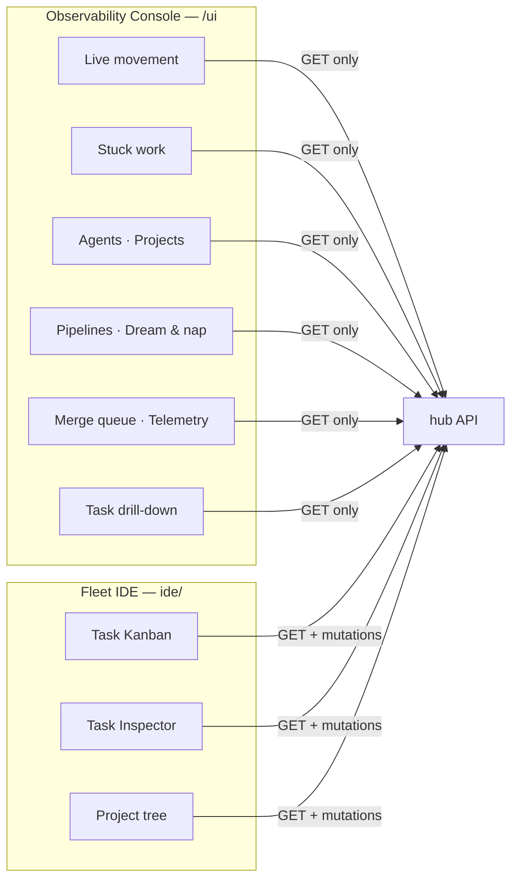

# The UI

mac ships two browser surfaces with deliberately opposite jobs. Knowing which
one you are in tells you whether anything you do can change the fleet.

## The observability console (`/ui`)

Served at `/ui` and `/ui/console`. Built from `observe/` (React + Vite) into
`src/mac/ui/console/`, which is committed — so serving it needs no Node.js at
runtime. Rebuild with `npm --prefix observe run build`; CI fails if the
committed bundle drifts from source.

**It is read-only, and that is the design.** `observe/tests/readonly.test.ts`
asserts it. The command-and-control dashboard that used to live here was
retired: it called `/dispatch/tick`, `/agents/bulk`, `/roles/seed`,
`/notifier/deliver` and `/secrets`, and a UI whose job is to observe cannot
also be the one that commands.

### Views

| view | answers |
|---|---|
| **Live** | what is moving right now — transitions per time bucket, stacked by the state work moved *into* |
| **Stuck work** | what has not moved, oldest first |
| **Agents** | who is registered, and whether the hub's belief is supported by evidence |
| **Projects** | per-project counts and repository registration |
| **Pipelines** | publication and review progress |
| **Dream & nap** | reflection cycles |
| **Merge queue** | depth against the AIMD window, and why changes did not land |
| **Telemetry** | model and command usage |
| **Task** | drill-down: history with detail, evidence, reviews, transcripts |

### Two properties it will not trade

**A section it could not read is absent, not zero.** If the hub fails to answer
for one section, that section is omitted and named in `degraded` — never
rendered as a plausible empty result. A merge queue showing "depth 0" because a
table is missing is exactly the failure the queue exists to catch.

**Unknown is not a default.** A queue that has never sized its window shows
`—`, not `1`; a land rate with no attempts shows `—`, not `0%`. Never-happened
and happened-badly are different facts.

### The live view

The Live chart is the one worth understanding. A count tells you 360 tasks are
blocked. Only a series over time tells you whether they are *arriving or
draining* — which is the difference between a backlog and a leak.

## The Fleet IDE (`ide/`)

The mutating surface: a task Kanban laned by state, a task inspector, and a
project tree. It is where you answer a parked task, direct an agent, or work a
queue.

The Kanban lanes are task **states**, and it deliberately has no drag-and-drop:
task states are a control-plane state machine with legal-move rules, leases and
evidence requirements, so most lane-to-lane drags would be illegal. A board
that offers a move it cannot make teaches you the UI lies about what it can do.

Run it with `make run-gui` after `mac admin login`.

## Which one am I in?

If you can change something, you are in the Fleet IDE. If you cannot, you are
in the console — and that is a guarantee, not an oversight.

## Getting a token in

The console reads a bearer token from `?t=<token>` on first load and moves it
into session storage, stripping it from the URL. It shares the storage key with
the IDE, so a session in one carries into the other.
